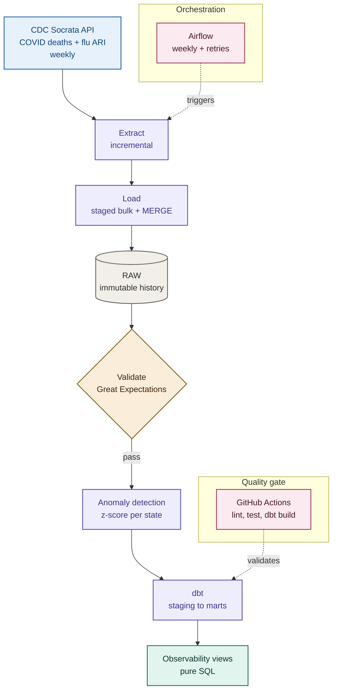

# Health Data Observability Platform

A data pipeline for CDC public health surveillance data (COVID-19 deaths and flu activity levels), built with an emphasis on **trust, not just movement**. It doesn't just move data from an API into a warehouse  it validates every load before anything downstream trusts it, flags statistically unusual data without failing the pipeline on it, logs every run in a structured, queryable format, and runs a CI/CD pipeline that catches regressions before they ship.


## Why this project

Every week, the CDC publishes state-level COVID death counts and flu activity levels. Like most real-world government data, it's messy: numbers get revised after publication, some states report late or not at all, and occasional data-entry errors slip through. This project builds a pipeline that doesn't just move that data into a warehouse — it **validates it, remembers its full history, and watches itself for problems**, so that anyone querying the resulting tables can trust what they're looking at.

## Architecture



Every stage logs to `OBSERVABILITY.PIPELINE_LOGS`. Every run's outcome is queryable with plain SQL — no BI tool required.

## Key design decisions

- **Immutable raw layer.** `RAW.COVID_DEATHS_RAW` is keyed on `(run_id, snapshot_date, state)`  not overwritten when CDC revises a week. This one design choice is what makes both "what we know now" and "what we knew back then" queryable from the same table.
- **Idempotent by design.** Loads use `MERGE`, not `INSERT`. Re-running the same batch twice never duplicates data — verified against live data, not just assumed.
- **Incremental, not brute-force.** Every extraction checks Snowflake first and only pulls weeks that aren't already there. A full 6-year backfill (16,200 rows) followed by a same-day re-run correctly pulled zero new rows.
- **Two kinds of "wrong," two separate checks.** Great Expectations catches *invalid* data (negative counts, broken schema) and stops the pipeline. Anomaly detection catches *valid but unusual* data (a real spike) and only flags it. Merging these two would make the pipeline either too fragile or too silent.

## Tech stack

| Layer | Tool | Purpose |
|---|---|---|
| Extraction | Python, `requests` | Pull CDC Socrata API data, incrementally |
| Warehouse | Snowflake | Immutable raw layer, staging, marts, observability schemas |
| Validation | Great Expectations | Fail-closed data quality gates |
| Transformation | dbt | Staging → marts, including as-reported/latest/revision-history modeling |
| Orchestration | Apache Airflow | Weekly scheduling, retries, failure alerting |
| Observability | Custom (Python + Snowflake) | Structured JSON logging, anomaly detection, pipeline health views |
| Alerting | Slack (incoming webhook) | Real-time failure notification |
| CI/CD | GitHub Actions | Lint, unit tests, GE suite validation, DAG import check, dbt build/test |
| Testing | pytest, dbt tests | Code-logic tests and data-quality tests, layered separately |

## Project structure

```
health-data-observability-platform/
├── dags/                          # Airflow DAG
├── dbt_project/                   # staging → marts → observability models
├── great_expectations/            # Validation suites
├── src/
│   ├── extract/                   # CDC API extractors (COVID, flu)
│   ├── load/                      # Snowflake loaders (idempotent MERGE)
│   ├── observability/             # Logging, anomaly detection, alerting
│   ├── validation/                # GE validation runners
│   └── utils/                     # Shared Snowflake connection
├── tests/                         # pytest unit tests
├── .github/workflows/ci.yml       # CI pipeline
└── setup.sql                      # Snowflake schema (source of truth)
```

## Setup

1. **Snowflake**: create a free trial account, then run `setup.sql` in a Snowsight worksheet to create the database, schemas, and tables.
2. **Environment**: copy `.env.example` to `.env` and fill in your Snowflake credentials and (optionally) a Slack webhook URL.
3. **Python**:
```bash
   python3 -m venv venv
   source venv/bin/activate
   pip install -r requirements.txt
```
4. **Run a manual pipeline pass**:
```bash
   python3 -c "
   from dotenv import load_dotenv
   load_dotenv()
   from src.extract.cdc_covid_deaths_extractor import run_extraction
   from src.load.snowflake_loader import load_covid_deaths
   records = run_extraction()
   if records:
       print(load_covid_deaths(records, run_id=records[0]['run_id']))
   "
```
5. **dbt**:
```bash
   cd dbt_project
   cp profiles.yml.example ~/.dbt/profiles.yml
   dbt deps
   dbt build
```
6. **Tests**: `pytest tests/ -v`


## About

Built by **Emmanuel Leakono** as a hands-on exploration of what separates a working pipeline from a trustworthy one  every design decision, bug, and fix in this repo was found and solved against real, live infrastructure, not simulated for the sake of a demo.

- GitHub: [github.com/LEAKONO](https://github.com/LEAKONO)
- Feedback and PRs welcome — if you spot something that could be more robust, open an issue.

If this project was useful or interesting, a ⭐ on the repo is appreciated.